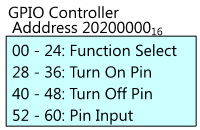
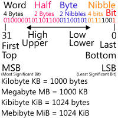

# 计算机实验室之树莓派：课程 1 OK01

>* 作者： Robert Mullins
>* 译者： LCTT qhwdw
>* <https://linux.cn/article-10458-1.htm>

OK01 课程讲解了树莓派如何入门，以及在树莓派上如何启用靠近 RCA 和 USB 端口的 OK 或 ACT 的 LED 指示灯。这个指示灯最初是为了指示 OK 状态的，但它在第二版的树莓派上被改名为 ACT。

## 1、入门
我们假设你已经访问了下载页面，并且已经获得了必需的 GNU 工具链。也下载了一个称为操作系统模板的文件。请下载这个文件并在一个新目录中解开它。

## 2、开始
现在，你已经展开了这个模板文件，在 source 目录中创建一个名为 main.s 的文件。这个文件包含了这个操作系统的代码。具体来看，这个文件夹的结构应该像下面这样：

> build/
>    (empty)
> source/
>    main.s
> kernel.ld
> LICENSE
> Makefile

用文本编辑器打开 main.s 文件，这样我们就可以输入汇编代码了。树莓派使用了称为 ARMv6 的汇编代码变体，这就是我们即将要写的汇编代码类型。

> 扩展名为 .s 的文件一般是汇编代码，需要记住的是，在这里它是 ARMv6 的汇编代码。

首先，我们复制下面的这些命令。

> .section .init
> .globl _start
> _start:

实际上，上面这些指令并没有在树莓派上做任何事情，它们是提供给汇编器的指令。汇编器是一个转换程序，它将我们能够理解的汇编代码转换成树莓派能够理解的机器代码。在汇编代码中，每个行都是一个新的命令。上面的第一行告诉汇编器 1 在哪里放我们的代码。我们提供的模板中将它放到一个名为 .init 的节中的原因是，它是输出的起始点。这很重要，因为我们希望确保我们能够控制哪个代码首先运行。如果不这样做，首先运行的代码将是按字母顺序排在前面的代码！.section 命令简单地告诉汇编器，哪个节中放置代码，从这个点开始，直到下一个 .section 或文件结束为止。

在汇编代码中，你可以跳行、在命令前或后放置空格去提升可读性。

接下来两行是停止一个警告消息，它们并不重要。

## 3、第一行代码
现在，我们正式开始写代码。计算机执行汇编代码时，是简单地一行一行按顺序执行每个指令，除非明确告诉它不这样做。每个指令都是开始于一个新行。

复制下列指令:

> ldr r0,=0x20200000

> ldr reg,=val 将数字 val 加载到名为 reg 的寄存器中。

那是我们的第一个命令。它告诉处理器将数字 0x20200000 保存到寄存器 r0 中。在这里我需要去回答两个问题，寄存器register是什么？0x20200000 是一个什么样的数字？

寄存器在处理器中就是一个极小的内存块，它是处理器保存正在处理的数字的地方。处理器中有很多寄存器，很多都有专门的用途，我们在后面会一一接触到它们。最重要的有十三个（命名为 r0、r1、r2、…、r9、r10、r11、r12），它们被称为通用寄存器，你可以使用它们做任何计算。由于是写我们的第一行代码，我们在示例中使用了 r0，当然你可以使用它们中的任何一个。只要后面始终如一就没有问题。

> 树莓派上的一个单独的寄存器能够保存任何介于 0 到 4,294,967,295（含）之间的任意整数，它可能看起来像一个很大的内存，实际上它仅有 32 个二进制比特。

0x20200000 确实是一个数字。只不过它是以十六进制表示的。下面的内容详细解释了十六进制的相关信息：

> 延伸阅读：十六进制解释
>
> 十六进制是另一种表示数字的方式。你或许只知道十进制的数字表示方法，十进制共有十个数字：0、1、2、3、4、5、6、7、8 和 9。十六进制共有十六个数字：0、1、2、3、4、5、6、7、8、9、a、b、c、d、e 和 f。
>
> 你可能还记得十进制是如何用位制来表示的。即最右侧的数字是个位，紧接着的左边一位是十位，再接着的左边一位是百位，依此类推。也就是说，它的值是 100 × 百位的数字，再加上 10 × 十位的数字，再加上 1 × 个位的数字。
>

 

 567 is 5 hundreds, 6 tens and 7 units.

> 从数学的角度来看，我们可以发现规律，最右侧的数字是 100 = 1s，紧接着的左边一位是 101 = 10s，再接着是 102 = 100s，依此类推。我们设定在系统中，0 是最低位，紧接着是 1，依此类推。但如果我们使用一个不同于 10 的数字为幂底会是什么样呢？我们在系统中使用的十六进制就是这样的一个数字。

  

 567 is 5x10^2+6x10^1+7x10^0

  

 567 = 5x10^2+6x10^1+7x10^0 = 2x16^2+3x16^1+7x16^0

>  上面的数学等式表明，十进制的数字 567 等于十六进制的数字 237。通常我们需要在系统中明确它们，我们使用下标 10 表示它是十进制数字，用下标 16 表示它是十六进制数字。由于在汇编代码中写上下标的小数字很困难，因此我们使用 0x 来表示它是一个十六进制的数字，因此 0x237 的意思就是 23716 。

>  那么，后面的 a、b、c、d、e 和 f 又是什么呢？好问题！在十六进制中为了能够写每个数字，我们就需要额外的东西。例如 916 = 9×160 = 910 ，但是 1016 = 1×161 + 1×160 = 1610 。因此，如果我们只使用 0、1、2、3、4、5、6、7、8 和 9，我们就无法写出 1010 、1110 、1210 、1310 、1410 、1510 。因此我们引入了 6 个新的数字，这样 a16 = 1010 、b16 = 1110 、c16 = 1210 、d16 = 1310 、e16 = 1410 、f16 = 1510 。

> 所以，我们就有了另一种写数字的方式。但是我们为什么要这么麻烦呢？好问题！由于计算机总是工作在二进制中，事实证明，十六进制是非常有用的，因为每个十六进制数字正好是四个二进制数字的长度。这种方法还有另外一个好处，那就是许多计算机的数字都是十六进制的整数倍，而不是十进制的整数倍。比如，我在上面的汇编代码中使用的一个数字 2020000016 。如果我们用十进制来写，它就是一个不太好记住的数字 53896806410 。

> 我们可以用下面的简单方法将十进制转换成十六进制：

  

 Conversion example

> 我们以十进制数字 567 为例来说明。
>
> 将十进制数字 567 除以 16 并计算其余数。例如 567 ÷ 16 = 35 余数为 7。
>
> 在十六进制中余数就是答案中的最后一位数字，在我们的例子中它是 7。
>
> 重复第 2 步和第 3 步，直到除法结果的整数部分为 0。例如 35 ÷ 16 = 2 余数为 3，因此 3 就是答案中的下一位。2 ÷ 16 = 0 余数为 2，因此 2 就是答案的接下来一位。
>
> 一旦除法结果的整数部分为 0 就结束了。答案就是反序的余数，因此 56710 = 23716。
>
> 转换十六进制数字为十进制，也很容易，将数字展开即可，因此 23716 = 2×162 + 3×161 +7 ×160 = 2×256 + 3×16 + 7×1 = 512 + 48 + 7 = 567。

因此，我们所写的第一个汇编命令是将数字 2020000016 加载到寄存器 r0 中。那个命令看起来似乎没有什么用，但事实并非如此。在计算机中，有大量的内存块和设备。为了能够访问它们，我们给每个内存块和设备指定了一个地址。就像邮政地址或网站地址一样，它用于标识我们想去访问的内存块或设备的位置。计算机中的地址就是一串数字，因此上面的数字 2020000016 就是 GPIO 控制器的地址。这个地址是由制造商的设计所决定的，他们也可以使用其它地址（只要不与其它的冲突即可）。我之所以知道这个地址是 GPIO 控制器的地址是因为我看了它的手册，3 地址的使用没有专门的规范（除了它们都是以十六进制表示的大数以外）。

## 4、启用输出

  

A diagram showing key parts of the GPIO controller.

阅读了手册可以得知，我们需要给 GPIO 控制器发送两个消息。我们必须用它的语言告诉它，如果我们这样做了，它将非常乐意实现我们的意图，去打开 OK 的 LED 指示灯。幸运的是，它是一个非常简单的芯片，为了让它能够理解我们要做什么，只需要给它设定几个数字即可。

>mov r1,#1
>
>lsl r1,#18
>
>str r1,[r0,#4]

 *mov reg,#val 将数字 val 放到名为 reg 的寄存器中。*

 *lsl reg,#val 将寄存器 reg 中的二进制操作数左移 val 位。*

 *str reg,[dest,#val] 将寄存器 reg 中的数字保存到地址 dest + val 上。*

> 这些命令的作用是在 GPIO 的第 16 号插针上启用输出。首先我们在寄存器 r1 中获取一个必需的值，接着将这个值发送到 GPIO 控制器。

> 因此，前两个命令是尝试取值到寄存器 r1 中，我们可以像前面一样使用另一个命令 ldr 来实现，但 lsl 命令对我们后面能够设置任何给定的 GPIO 针比较有用，因此从一个公式中推导出值要比直接写入来好一些。表示 OK 的 LED 灯是直接连线到 GPIO 的第 16 号针脚上的，因此我们需要发送一个命令去启用第 16 号针脚。

> 寄存器 r1 中的值是启用 LED 针所需要的。第一行命令将数字 110 放到 r1 中。在这个操作中 mov 命令要比 ldr 命令快很多，因为它不需要与内存交互，而 ldr 命令是将需要的值从内存中加载到寄存器中。

>尽管如此，mov 命令仅能用于加载某些值。4 在 ARM 汇编代码中，基本上每个指令都使用一个三字母代码表示。它们被称为助记词，用于表示操作的用途。mov 是 “move” 的简写，而 ldr 是 “load register” 的简写。mov 是将第二个参数 #1 移动到前面的 r1 寄存器中。一般情况下，# 肯定是表示一个数字，但我们已经看到了不符合这种情况的一个反例。

> 第二个指令是 lsl（逻辑左移）。它的意思是将第一个参数的二进制操作数向左移第二个参数所表示的位数。在这个案例中，将 110 （即 12 ）向左移 18 位（将它变成 10000000000000000002=26214410 ）。

如果你不熟悉二进制表示法，可以看下面的内容：

> 延伸阅读： 二进制解释
>
> 与十六进制一样，二进制是写数字的另一种方法。在二进制中只有两个数字，即 0 和 1。它在计算机中非常有用，因为我们可以用电路来实现它，即电流能够通过电路表示为 1，而电流不能通过电路表示为 0。这就是计算机能够完成真实工作和做数学运算的原理。尽管二进制只有两个数字，但它却能够表示任何一个数字，只是写起来有点长而已。
>

  

567 in decimal = 1000110111 in binary

 

> 这个图片展示了 56710 的二进制表示是 10001101112 。我们使用下标 2 来表示这个数字是用二进制写的。

> 我们在汇编代码中大量使用二进制的其中一个巧合之处是，数字可以很容易地被 2 的幂（即 1、2、4、8、16）乘或除。通常乘法和除法都是非常难的，而在某些特殊情况下却变得非常容易，所以二进制非常重要。
>

  

13*4 = 52, 1101*100=110100

 

> 将一个二进制数字左移 n 位就相当于将这个数字乘以 2n。因此，如果我们想将一个数乘以 4，我们只需要将这个数字左移 2 位。如果我们想将它乘以 256，我们只需要将它左移 8 位。如果我们想将一个数乘以 12 这样的数字，我们可以有一个替代做法，就是先将这个数乘以 8，然后再将那个数乘以 4，最后将两次相乘的结果相加即可得到最终结果（N × 12 = N × (8 + 4) = N × 8 + N × 4）。

 

  

53/16 = 3, 110100/10000=11

 

> 右移一个二进制数 n 位就相当于这个数除以 2n 。在右移操作中，除法的余数位将被丢弃。不幸的是，如果对一个不能被 2 的幂次方除尽的二进制数字做除法是非常难的，这将在 [课程 9](./OK09.md) Screen04 中讲到。

 

  

Binary Terminology

 

> 这个图展示了二进制常用的术语。一个比特bit就是一个单独的二进制位。一个“半字节nibble“ 是 4 个二进制位。一个字节byte是 2 个半字节，也就是 8 个比特。半字half是指一个字长度的一半，这里是 2 个字节。字word是指处理器上寄存器的大小，因此，树莓派的字长是 4 字节。按惯例，将一个字最高有效位标识为 31，而将最低有效位标识为 0。顶部或最高位表示最高有效位，而底部或最低位表示最低有效位。一个 kilobyte（KB）就是 1000 字节，一个 megabyte 就是 1000 KB。这样表示会导致一些困惑，到底应该是 1000 还是 1024（二进制中的整数）。鉴于这种情况，新的国际标准规定，一个 KB 等于 1000 字节，而一个 Kibibyte（KiB）是 1024 字节。一个 Kb 是 1000 比特，而一个 Kib 是 1024 比特。

> 树莓派默认采用小端法，也就是说，从你刚才写的地址上加载一个字节时，是从一个字的低位字节开始加载的。

再强调一次，我们只有去阅读手册才能知道我们所需要的值。

手册上说，GPIO 控制器中有一个 24 字节的集合，由它来决定 GPIO 针脚的设置。第一个 4 字节与前 10 个 GPIO 针脚有关，第二个 4 字节与接下来的 10 个针脚有关，依此类推。

总共有 54 个 GPIO 针脚，因此，我们需要 6 个 4 字节的一个集合，总共是 24 个字节。在每个 4 字节中，每 3 个比特与一个特定的 GPIO 针脚有关。

我们想去启用的是第 16 号 GPIO 针脚，因此我们需要去设置第二组 4 字节，因为第二组的 4 字节用于处理 GPIO 针脚的第 10-19 号，而我们需要第 6 组 3 比特，它在上面的代码中的编号是 18（6×3）。

最后的 str（“store register”）命令去保存第一个参数中的值，将寄存器 r1 中的值保存到后面的表达式计算出来的地址上。这个表达式可以是一个寄存器，在上面的例子中是 r0，我们知道 r0 中保存了 GPIO 控制器的地址，而另一个值是加到它上面的，在这个例子中是 #4。它的意思是将 GPIO 控制器地址加上 4 得到一个新的地址，并将寄存器 r1 中的值写到那个地址上。那个地址就是我们前面提到的第二组 4 字节的位置，因此，我们发送我们的第一个消息到 GPIO 控制器上，告诉它准备启用 GPIO 第 16 号针脚的输出。

## 5、生命的信号
现在，LED 已经做好了打开准备，我们还需要实际去打开它。意味着需要给 GPIO 控制器发送一个消息去关闭 16 号针脚。是的，你没有看错，就是要发送一个关闭的消息。芯片制造商认为，在 GPIO 针脚关闭时打开 LED 更有意义。5 硬件工程师经常做这种反常理的决策，似乎是为了让操作系统开发者保持警觉。可以认为是给自己的一个警告。

> mov r1,#1
>
> lsl r1,#16
>
> str r1,[r0,#40]

希望你能够认识上面全部的命令，先不要管它的值。第一个命令和前面一样，是将值 1 推入到寄存器 r1 中。第二个命令是将二进制的 1 左移 16 位。由于我们是希望关闭 GPIO 的 16 号针脚，我们需要在下一个消息中将第 16 比特设置为 1（想设置其它针脚只需要改变相应的比特位即可）。最后，我们写这个值到 GPIO 控制器地址加上 4010 的地址上，这将使那个针脚关闭（加上 28 将打开针脚）。

## 6、永远幸福快乐
似乎我们现在就可以结束了，但不幸的是，处理器并不知道我们做了什么。事实上，处理器只要通电，它就永不停止地运转。因此，我们需要给它一个任务，让它一直运转下去，否则，树莓派将进入休眠（本示例中不会，LED 灯会一直亮着）。

> loop$:
>
> b loop$

> *name: 下一行的名字。*
>
> *b label 下一行将去标签 label 处运行。*

第一行不是一个命令，而是一个标签。它给下一行命名为 loop$，这意味着我们能够通过名字来指向到该行。这就称为一个标签。当代码被转换成二进制后，标签将被丢弃，但这对我们通过名字而不是数字（地址）找到行比较有用。按惯例，我们使用一个 ​$ 表示这个标签只对这个代码块中的代码起作用，让其它人知道，它不对整个程序起作用。b（“branch”）命令将去运行指定的标签中的命令，而不是去运行它后面的下一个命令。因此，下一行将再次去运行这个 b 命令，这将导致永远循环下去。因此处理器将进入一个无限循环中，直到它安全关闭为止。

代码块结尾的一个空行是有意这样写的。GNU 工具链要求所有的汇编代码文件都是以空行结束的，因此，这就可以你确实是要结束了，并且文件没有被截断。如果你不这样处理，在汇编器运行时，你将收到烦人的警告。

## 7、树莓派上场
由于我们已经写完了代码，现在，我们可以将它上传到树莓派中了。在你的计算机上打开一个终端，改变当前工作目录为 source 文件夹的父级目录。输入 make 然后回车。如果报错，请参考排错章节。如果没有报错，你将生成三个文件。 kernel.img 是你的编译后的操作系统镜像。kernel.list 是你写的汇编代码的一个清单，它实际上是生成的。这在将来检查程序是否正确时非常有用。kernel.map 文件包含所有标签结束位置的一个映射，这对于跟踪值非常有用。

为安装你的操作系统，需要先有一个已经安装了树莓派操作系统的 SD 卡。如果你浏览 SD 卡中的文件，你应该能看到一个名为 kernel.img 的文件。将这个文件重命名为其它名字，比如 kernel_linux.img。然后，复制你编译的 kernel.img 文件到 SD 卡中原来的位置，这将用你的操作系统镜像文件替换现在的树莓派操作系统镜像。想切换回来时，只需要简单地删除你自己的 kernel.img 文件，然后将前面重命名的文件改回 kernel.img 即可。我发现，保留一个原始的树莓派操作系统的备份是非常有用的，万一你要用到它呢。

将这个 SD 卡插入到树莓派，并打开它的电源。这个 OK 的 LED 灯将亮起来。如果不是这样，请查看故障排除页面。如果一切如愿，恭喜你，你已经写出了你的第一个操作系统。课程 2 OK02 将指导你让 LED 灯闪烁和关闭闪烁。

-------------------------

1. 是的，我说错了，它告诉的是链接器，它是另一个程序，用于将汇编器转换过的几个代码文件链接到一起。直接说是汇编器也没有大问题。

2. 其实它们对你很重要。由于 GNU 工具链主要用于开发操作系统，它要求入口点必须是名为 _start 的地方。由于我们是开发一个操作系统，无论什么时候，它总是从 _start 开时的，而我们可以使用 .section .init 命令去设置它。因此，如果我们没有告诉它入口点在哪里，就会使工具链困惑而产生警告消息。所以，我们先定义一个名为 _start 的符号，它是所有人可见的（全局的），紧接着在下一行生成符号 _start 的地址。我们很快就讲到这个地址了。

3. 本教程的设计减少了你阅读树莓派开发手册的难度，但是，如果你必须要阅读它，你可以在这里 SoC-Peripherals.pdf 找到它。由于添加了混淆，手册中 GPIO 使用了不同的地址系统。我们的操作系统中的地址 0x20200000 对应到手册中是 0x7E200000。

4. mov 能够加载的值只有前 8 位是 1 的二进制表示的值。换句话说就是一个 0 后面紧跟着 8 个 1 或 0。

5. 一个很友好的硬件工程师是这样向我解释这个问题的：

6. 原因是现在的芯片都是用一种称为 CMOS 的技术来制成的，它是互补金属氧化物半导体的简称。互补的意思是每个信号都连接到两个晶体管上，一个是使用 N 型半导体的材料制成，它用于将电压拉低，而另一个使用 P 型半导体材料制成，它用于将电压升高。在任何时刻，仅有一个半导体是打开的，否则将会短路。P 型材料的导电性能不如 N 型材料。这意味着三倍大的 P 型半导体材料才能提供与 N 型半导体材料相同的电流。这就是为什么 LED 总是通过降低为低电压来打开它，因为 N 型半导体拉低电压比 P 型半导体拉高电压的性能更强。

7. 还有一个原因。早在上世纪七十年代，芯片完全是由 N 型材料制成的（NMOS），P 型材料部分使用了一个电阻来代替。这意味着当信号为低电压时，即便它什么事都没有做，芯片仍然在消耗能量（并发热）。你的电话装在口袋里什么事都不做，它仍然会发热并消耗你的电池电量，这不是好的设计。因此，信号设计成 “活动时低”，而不活动时为高电压，这样就不会消耗能源了。虽然我们现在已经不使用 NMOS 了，但由于 N 型材料的低电压信号比 P 型材料的高电压信号要快，所以仍然使用了这种设计。通常在一个 “活动时低” 信号名字上方会有一个条型标记，或者写作 SIGNAL_n 或 /SIGNAL。但是即便这样，仍然很让人困惑，那怕是硬件工程师，也不可避免这种困惑！

> via: https://www.cl.cam.ac.uk/projects/raspberrypi/tutorials/os/ok01.html
>
> 作者：Robert Mullins 选题：lujun9972 译者：qhwdw 校对：wxy
>
> 本文由 LCTT 原创编译，Linux中国 荣誉推出
